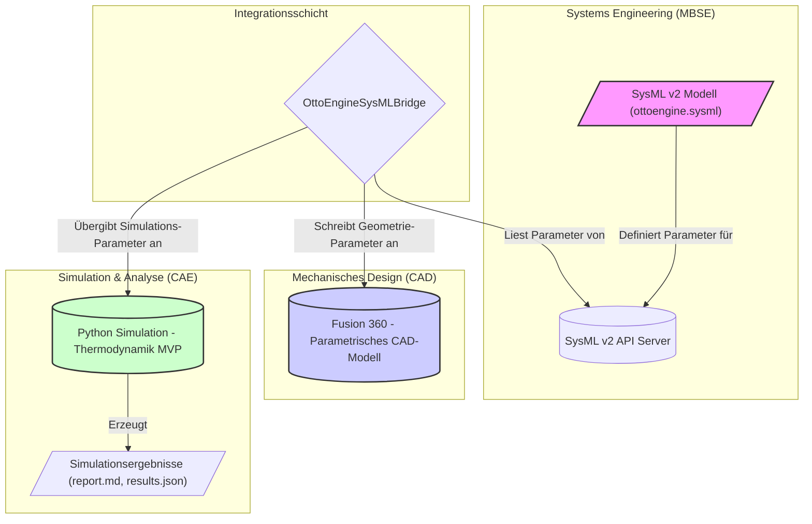

# Projektdokumentation: Digitaler Zwilling eines Ottomotors

Dieses Dokument beschreibt das Projekt "OttoEngine", dessen Ziel die Entwicklung einer durchgängigen digitalen Prozesskette für den Entwurf und die Simulation eines Ottomotors mittels Model-Based Systems Engineering (MBSE) ist.

## 1. Projektziel

Das Hauptziel dieses Projekts ist die Schaffung eines "Digital Threads" – eines durchgängigen digitalen Fadens –, der ein formales Systemmodell (SysML) mit einem 3D-CAD-Modell und einer physikalischen Simulation verbindet. Anstatt diese drei Domänen isoliert zu behandeln, werden Änderungen am zentralen Systemmodell automatisch und konsistent in die anderen Modelle übertragen.

Konkret bedeutet das:
- **Zentralisierung der Parameter:** Alle relevanten Systemparameter (z. B. Hubraum, Bohrung, Hub, Verdichtungsverhältnis) werden an einem einzigen Ort – dem SysML-Modell – als "Single Source of Truth" definiert.
- **Automatisierung der CAD-Modellierung:** Das parametrische 3D-CAD-Modell des Motors in Autodesk Fusion 360 wird automatisch aktualisiert, wenn sich die Parameter im SysML-Modell ändern.
- **Integrierte Simulation:** Eine thermodynamische Simulation des Otto-Kreisprozesses verwendet ebenfalls die Parameter aus dem SysML-Modell, um Leistung und Effizienz zu berechnen.
- **Konsistenz und Effizienz:** Manuelle Übertragungsfehler werden eliminiert und der Zeitaufwand für Design-Iterationen drastisch reduziert.

## 2. Systemkontext

Das Projekt realisiert eine Pipeline, die aus drei Hauptkomponenten besteht, welche durch eine Brückenanwendung (Bridge) miteinander verbunden sind.

*   **Der Ingenieur** modifiziert das **SysML-Modell**.
*   Die **OttoEngineSysMLBridge** (ein Fusion 360 Add-in) liest die Änderungen über die **SysML v2 API**.
*   Die Bridge passt die Parameter des **CAD-Modells** in Fusion 360 an.
*   Gleichzeitig werden die relevanten Parameter an das **Python-Simulationsskript** übergeben, das die neuen Kennzahlen berechnet.

## 3. Mein Beitrag

Als Entwickler dieses Prototyps habe ich die folgenden Kernkomponenten und Artefakte erstellt:

1.  **`OttoEngineSysMLBridge`**: Ein in Python geschriebenes Add-in für Autodesk Fusion 360. Es stellt die Verbindung zwischen dem lokalen CAD-Programm und dem SysML-API-Server her. Ich habe die Logik für die Synchronisation in beide Richtungen implementiert (`sync_from_sysml.py`, `sync_to_sysml.py`).
2.  **SysML-Modell (`ottoengine.sysml`)**: Das Kernmodell, das die Systemarchitektur, Anforderungen und die zentralen Parameter des Ottomotors in SysML v2 definiert.
3.  **Simulations-MVP (`src/otto_sim/mvp.py`)**: Ein "Minimum Viable Product" zur Berechnung des thermodynamischen Kreisprozesses. Dieses Skript liest die Systemparameter und erzeugt einen Ergebnisbericht.
4.  **Automatisierungsskripte**: Diverse Hilfsskripte zur Automatisierung des Workflows, wie `tools/run_otto_mvp.py` zum Ausführen der Simulation und `scripts/api/upload_ottoengine.py` zum Hochladen des SysML-Modells.
5.  **Test-Suite**: Unit-Tests (`tests/`), um die korrekte Funktion der Simulationsberechnungen und der Parameter-Mappings sicherzustellen.
6.  **Dokumentation**: Erstellung von Anleitungen und Beschreibungen (`docs/`), um die Nutzung und Installation der Komponenten zu erleichtern.

## 4. Tools & Methoden

- **Methodik**: Model-Based Systems Engineering (MBSE)
- **Sprachen**: Python, SysML v2
- **Kerntechnologien**:
    - SysML v2 API Services (gehostet via Docker, siehe `infra/docker-compose.yml`)
    - Autodesk Fusion 360 API für CAD-Automatisierung
- **Software & Werkzeuge**:
    - Autodesk Fusion 360
    - Python 3.x
    - Git (zur Versionskontrolle)
    - Docker (für die Infrastruktur des SysML-Servers)
    - Visual Studio Code (als Entwicklungsumgebung)

## 5. Ergebnisse

Das Projekt hat erfolgreich einen funktionierenden Prototyp der MBSE-Pipeline hervorgebracht. Die wichtigsten Ergebnisse sind:

- **Ein parametrisches CAD-Modell** eines Vier-Zylinder-Ottomotors, das sich automatisch anpasst.
- **Ein funktionierendes Simulations-MVP**, das KPIs wie Leistung und Wirkungsgrad auf Basis des Systemmodells berechnet und in `outputs/otto_mvp/` ablegt.
- **Eine signifikante Reduzierung des manuellen Aufwands** bei Designänderungen, was die Konsistenz zwischen den Disziplinen sicherstellt.
- **Eine praktische Demonstration**, wie die Prinzipien von MBSE und "Digital Thread" mit modernen, API-gesteuerten Werkzeugen umgesetzt werden können.
