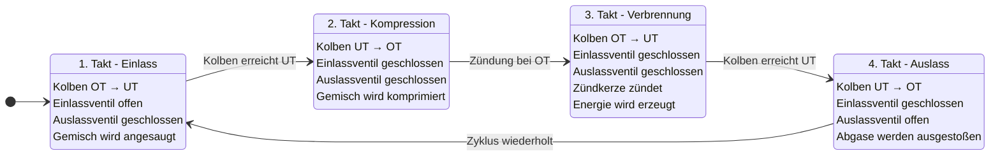

# 4-Takt-Motor State Diagram



## Gefundene Fehler:

1. **Fehlende Mermaid-Code-Block-Wrapper**: Der Code muss in ` ```mermaid ` eingeschlossen sein
2. **Syntax-Problem**: Mehrfache Beschreibungen mit `:` für denselben State-Namen funktionieren nicht direkt in Mermaid
3. **Lösung**: Verwendung von verschachtelten States mit internen Beschreibungen

Das Diagramm zeigt nun die 4 Takte eines Verbrennungsmotors im zyklischen Ablauf.
